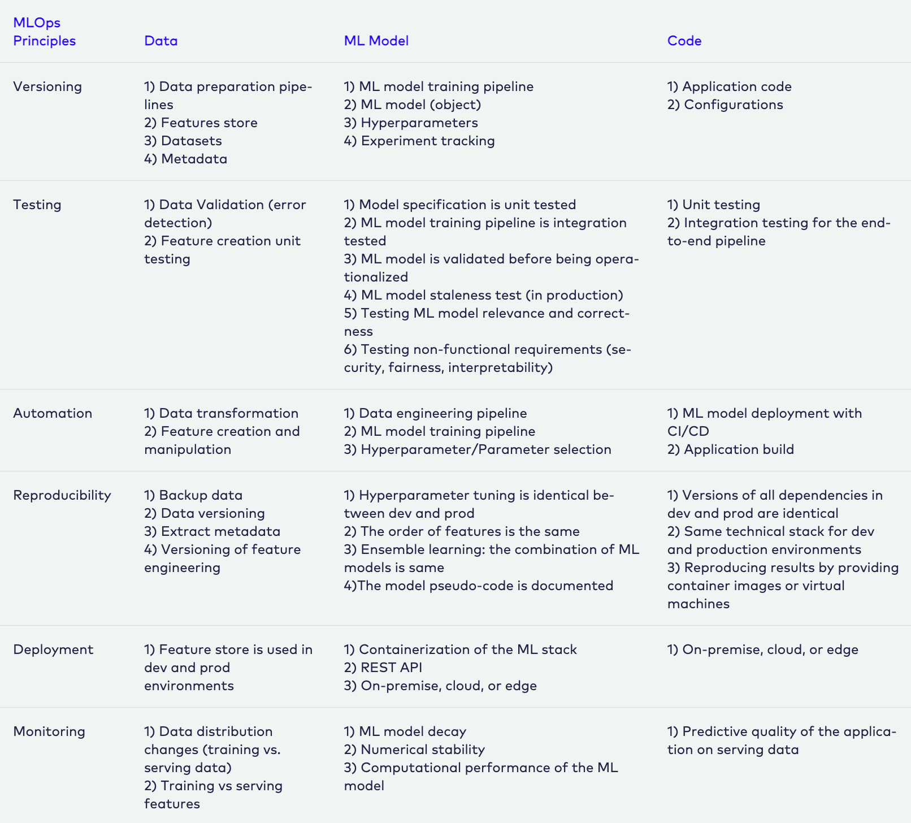

## MLOps Best Practices

<!-- AWS framework -->

<!-- A note on the fact that this is technically covered in the prerequisites section, but requires further elaboration given its importance -->

<blockquote class="callout callout_warn">
⚠️<b> Note</b>
     
    While best practices for MLOps is technically covered in the <a href="https://digicatapult.github.io/bridgeAI-MLOps-knowledge-hub/prerequisites.html" target="_blank">Prerequisites</a> section, separate elaboration on these principles is required given their importance.
</blockquote>

The principles (or best practices) concerning MLOps are:
- Automation
- Continuous X
- Versioning
- Experiment Tracking
- Testing
- Monitoring

Here is a summary of core considerations for each principle as it relates to the the three levels where changes can take place (in your data, algorithm and code):

## Considerations for a Well-Architected Framework

While this does not contain a strict set of guidelines, the [AWS Well-Architected Framework](https://docs.aws.amazon.com/wellarchitected/latest/framework/welcome.html){:target="_blank"} is a reliable resource for evaluating whether specific architecture aligns well with cloud best practices. The pillars of the framework (each with their own set of additional considerations) are:

- Operational excellence
- Security
- Reliability
- Performance efficiency
- Cost optimization
- Sustainability

## Resources

1. [MLOps.org](https://ml-ops.org/content/mlops-principles){:target="_blank"}

2. [AWS Well-Architected Framework Guide](https://docs.aws.amazon.com/wellarchitected/latest/framework/welcome.html){:target="_blank"}