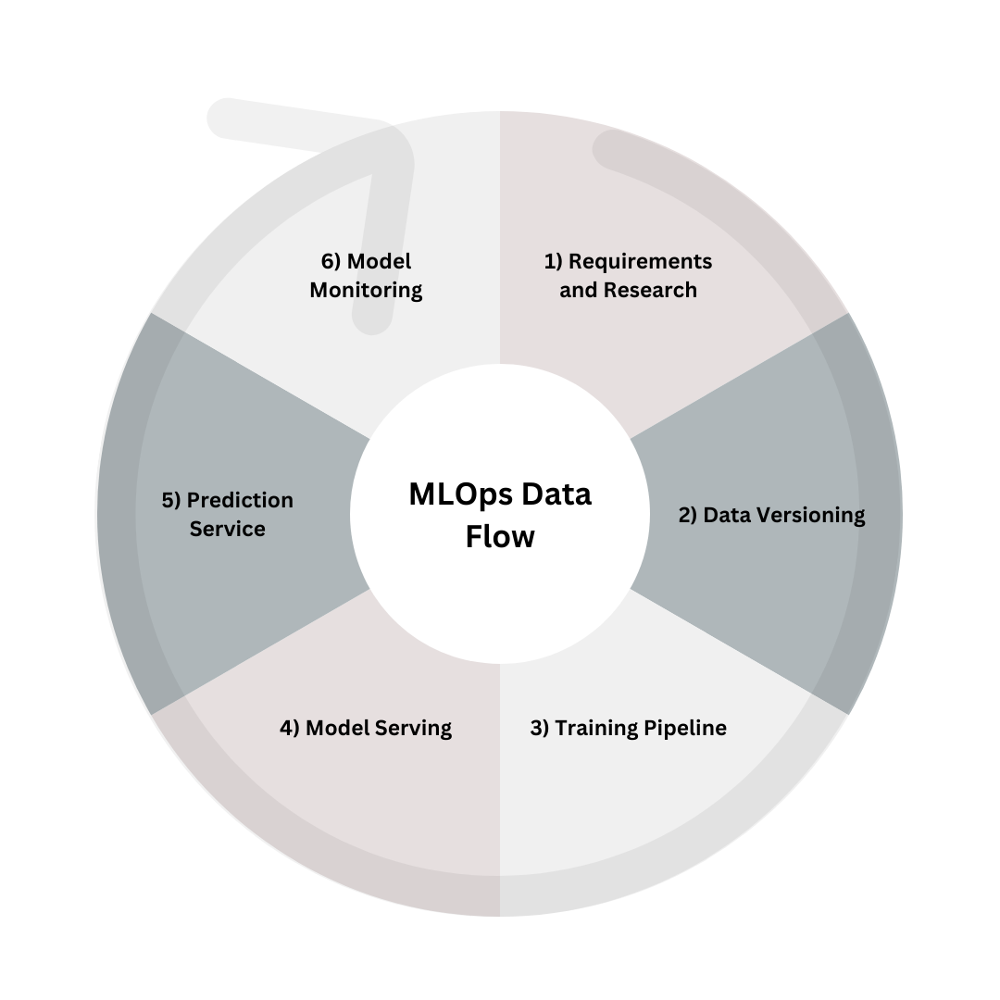

## What is MLOps?

MLOps is a set of practices that aims to unify the release cycle for machine learning and software application release. This is done through application of agile principles to machine learning projects, mainly by automating the testing of machine learning artifacts (e.g. data validation, ML model testing, and ML model integration testing).

## MLOps Big Picture Summary

Each page under "MLOps: The Big Picture" has been designed to address the research, implementation and troubleshooting regarding each component of the team's MLOps pipeline. The components, which are reflective of the typical order in which data flows through an MLOps pipeline, comprise:

<!-- this image is to be replaced with flow diagram, to better show the data that flows through each stage -->

NOTE: While GitOps is not a component of an MLOps pipeline that data can flow through, it is the foundation on which the DC AI/ML team built the MLOps pipeline available to you and is therefore discussed as part of the architecture of the pipeline.

Overviews of each component through which data flows in an MLOps pipeline can be found in the [Horizon Scan](https://digicatapult.github.io/bridgeAI-MLOps-knowledge-hub/prerequisites.html#architecture-overview){:target="_blank"} page.

## Corporate Perspective Summary

Aside from the research and implementation surrounding each component of our pipeline, we also captured aspects of our corporate approaches to this project for your consideration. 

<b>Corporate perspective</b> considerations include a maturity assessment for evaluating the viability of your MLOps pipeline, required skills and roles for automating your AI/ML offering, and a horizon scan of tools you can use for each component of the pipeline. 

A [Deployment Service Life Cycle framework](https://digicatapult.github.io/bridgeAI-MLOps-knowledge-hub/deployment_lifecycle.html){:target="_blank"} is also available for you to use as a guide for additional considerations in this context. This framework serves as a starting point for ensuring that organisations adequately gather information on their requirements (as well as use cases, current infrastructure requirements, and constraints) before assessing these and designing and implementing an AI/ML offering around them. It also acts as a reminder for points of review for the offering after it has been implemented. 

## Resources

1. [MLOps.org](https://ml-ops.org/){:target="_blank"}