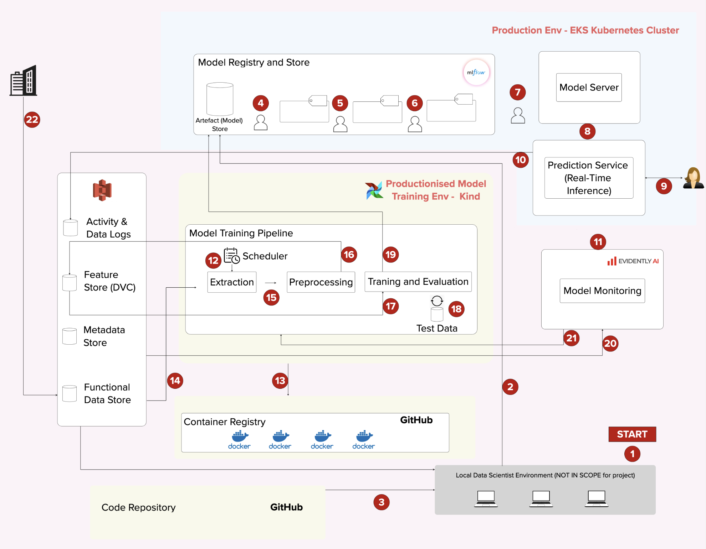

## Team MLOps Architecture

<h3>The Team's Architecture <a href="https://app.mural.co/t/jmsandbox6893/m/jmsandbox6893/1723564838519/90dee27020222851bf2f8b62c04fd272c25fd1d3?sender=udec36d924fb252f9f2506642" target="_blank">Mural</a>:</h3>

<!-- intrinsic size - 1980 by 1542; div w and h by 2.36 -->

<map name = "arch">
    <area shape = "circle" coords="752,540,10" alt="Model Development" href = "/team_arch.html#1-model-development">
    <!-- <area target="" alt="" title="" href="" coords="1431,1087,22" shape="circle">
    <area target="" alt="" title="" href="" coords="1069,1409,23" shape="circle">
    <area target="" alt="" title="" href="" coords="733,288,20" shape="circle">
    <area target="" alt="" title="" href="" coords="957,289,21" shape="circle">
    <area target="" alt="" title="" href="" coords="1164,291,21" shape="circle">
    <area target="" alt="" title="" href="" coords="1456,260,24" shape="circle">
    <area target="" alt="" title="" href="" coords="1648,366,26" shape="circle">
    <area target="" alt="" title="" href="" coords="1862,523,21" shape="circle">
    <area target="" alt="" title="" href="" coords="1459,448,26" shape="circle">
    <area target="" alt="" title="" href="" coords="1680,679,23" shape="circle">
    <area target="" alt="" title="" href="" coords="599,730,24" shape="circle">
    <area target="" alt="" title="" href="" coords="786,1071,20" shape="circle">
    <area target="" alt="" title="" href="" coords="492,1070,20" shape="circle">
    <area target="" alt="" title="" href="" coords="763,836,21" shape="circle">
    <area target="" alt="" title="" href="" coords="980,714,21" shape="circle">
    <area target="" alt="" title="" href="" coords="1094,858,25" shape="circle">
    <area target="" alt="" title="" href="" coords="1281,870,21" shape="circle">
    <area target="" alt="" title="" href="" coords="1097,714,22" shape="circle">
    <area target="" alt="" title="" href="" coords="1708,963,28" shape="circle">
    <area target="" alt="" title="" href="" coords="1605,947,25" shape="circle">
    <area target="" alt="" title="" href="" coords="92,335,22" shape="circle"> -->
    <area shape = "rect" coords = "22,83,126,125" alt = "Industry Data"
    href = "/team_arch.html#22-industry-data"/>
</map>

## Components

The following explanations apply to the team's MLOps architecture:

### 1. Model Development

Data scientists develop models locally.

### 2. Model(s) pushed

All models are stored in the artefact store in MLflow.

File type: `.pth`\
Data visibility: High\
Frequency of data flow: On demand

<!-- ### 22. Industry Data  -->

<!-- [blurb on what/why]

[explanation of process (copy from Mural)]

[expand on process] -->

<!-- <area shape = "circle" coords="" alt="" href = ""> -->