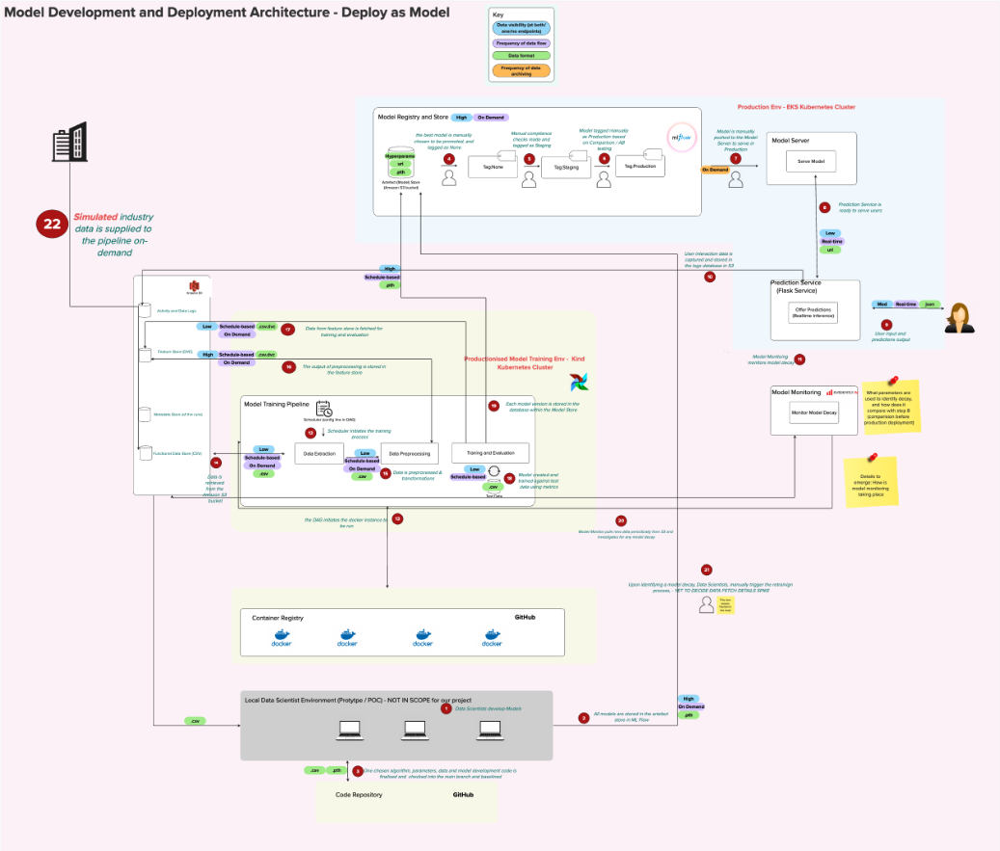

## Team MLOps Architecture

<h3>The Team's Architecture <a href="https://app.mural.co/t/jmsandbox6893/m/jmsandbox6893/1723564838519/90dee27020222851bf2f8b62c04fd272c25fd1d3?sender=udec36d924fb252f9f2506642" target="_blank">Mural</a>:</h3>

<!-- <map name = "lessons">
    <area shape = "rect" coords = "22,83,126,125" alt = "Industry Data"
    href = "/team_arch.html#industry-data"/>
</map>

## Components

### Industry Data 

[blurb on what/why]

[explanation of process (copy from Mural)]

[expand on process]

-->
