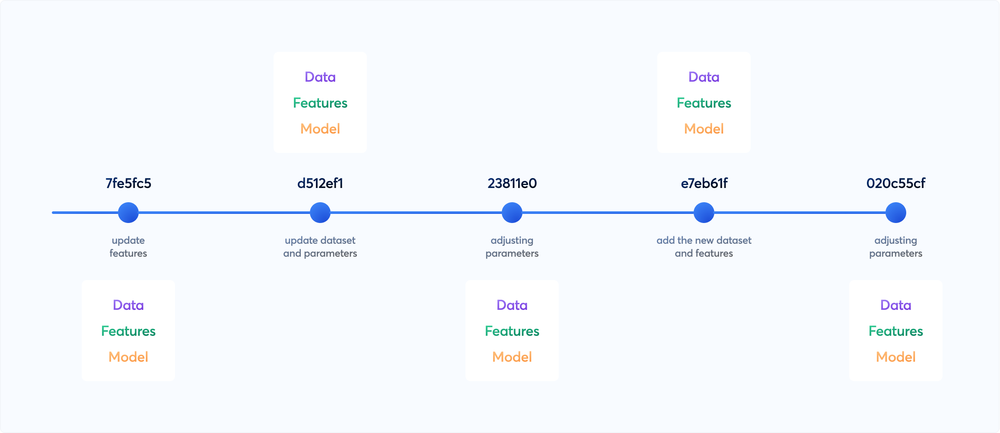

# Data Versioning Spike Content

**Table of Contents**
1. [General Comparison](#1-general-comparison)\
        [DVC](#11-dvc)\
        [MLFlow](#12-mlflow)\
        [General Comparison Table](#13-general-comparison-table)
2. [Data Versioning](#2-data-versioning)\
        [DVC](#21-dvc)\
        [MLFlow](#22-mlflow)
3. [Where Data is Stored](#3-where-the-data-is-stored)\
        [DVC](#31-dvc)\
        [MLFlow](#32-mlflow)
4. [How to Version](#4-how-to-version)
        [DVC](#41-dvc)\
        [MLFlow](#42-mlflow)
5. [Potential Options](#5-potential-options)
        [Using MLFlow](#51-using-mlflow)\
        [Using DVC Within Train Repo](#52-use-dvc-within-train-repo)\
        [Using DVC for Data Versioning During Ingestion with Train, Eval, and Test Split](#53-use-dvc-for-data-versioning-during-ingestion-with-train-eval-and-test-split)
[Summary](#summary)\
[References](#references)

>Here is a summary of the investigation conducted to determine which version control tool is best suited for our MLOps pipeline and integrates well with our existing technology and tool stack.
>
>The tools compared are MLFlow and DVC (Data Version Control).


An image showing the different versions of data, features and model. Source: [DVC](https://dvc.org/doc/use-cases/versioning-data-and-model-files)

---

The type of data versioning each tool supports:

Standalone data versioning

Associating data with a training run in an experiment

Where the data is stored (remote, local, or database)

How to perform versioning with each tool (including sample steps and code snippets)

How to retrieve versioned data for re-training or reproducibility

A verdict on which tool is more suitable for our current use case

---

## 1. General Comparison
### 1.1 DVC
DVC(Data Version Control) is an open-source version control system specifically designed to handle large datasets and machine learning models. It focuses on data versioning, reproducibility, and collaboration.

DVC provides a way to manage data and machine learning models in a version-controlled manner, similar to how Git handles code.

### 1.2 MLFlow
MLFlow is an open-source platform designed to manage the end-to-end machine learning lifecycle, including experimentation, reproducibility, and deployment. It is particularly well-suited for tracking and managing machine learning experiments.

MLflow offers the ability to track datasets that are associated with model training events. These metadata associated with the Dataset can be stored through the use of the mlflow.log_input() API.

### 1.3 General Comparison Table:

Feature | MLFlow | DVC 
--- | --- | --- 
Primary Focus | Experiment tracking and model management | Data versioning and pipeline management 
--- | --- | --- 
Data Versioning | Limited, relies on external tools | Comprehensive, designed for large datasets 
--- | --- | --- 
Experiment Tracking | Yes, detailed tracking and comparison | Basic, primarily through Git 
--- | --- | --- 
Pipeline Management | Basic, experimental | Advanced, tracks data and code changes 
--- | --- | --- 
Model Management | Advanced, with deployment options | Basic, through versioning 
--- | --- | --- 
Integration | Integrates well with various ML tools | Integrates with Git and various storage backends 
--- | --- | --- 
Reproducibility | Focus on reproducibility of experiments | Strong focus, tracks entire pipeline along with data and model 
--- | --- | --- 
Ease of Use | User-friendly interface, extensive documentation, simple python API | Requires understanding of Git, more command-line oriented

## 2. Data Versioning

### 2.1 DVC

DVC tracks changes in data files and directories

When you add data files to DVC, it creates metadata files (.dvc files) that store information about the data, including its version and remote location

These DVC files can be committed to a Git repository, allowing you to track the data's history and lineage along with your code.

### 2.2 MLFlow

MLFlow doesn’t really can do version control of data independently, it relies on external tools

However, the `mlflow.data` module helps you record your model training and evaluation datasets to runs and stores in artefact store

It can later retrieve dataset information from runs

## 3. Where the Data is Stored

### 3.1 DVC

DVC remotes are distributed storage locations for the data sets and ML models. It is similar to Git remotes, but for cached assets. This optional feature is typically used to share or back up copies of all or some of your data. Several types are supported: Amazon S3, Google Drive, SSH, HTTP, local file systems, among others.

[DVC remote](https://dvc.org/doc/command-reference/remote#remote)

### 3.2 MLFlow
MLFlow tracking needs the following components.

**Backend store**
Experiment metadata including run ID, start & end time, parameters, metrics, etc are stored in Backend store. MLflow supports two types of storage for the backend: file-system-based like local files and database-based like PostgreSQL. Default is sqlite.

**Artefact store**

Artifact store persists typically large artifacts for each run, such as model weights (e.g. a pickled scikit-learn model, pytorch model, etc) and data files (e.g. csv or parquet files). MLflow stores artifacts in a local file (mlruns) by default, but also supports different storage options such as Amazon S3 and Azure Blob Storage.

Backend store - Backend Stores — MLflow 2.15.1 documentation 

Artefact store - Artifact Stores — MLflow 2.15.1 documentation 

Tracking server - MLflow Tracking Server 

## 4. How to Version

### 4.1 DVC

DVC uses git and similar to git commands to version data.

Install DVC: `pip install dvc`

Initialize DVC from a git repo: `dvc init`

Configure remote (s3): `dvc remote add -d myremote s3://mybucket/path/to/dvcstore`

Add data files or directories: `dvc add training_data test_data data.csv`

Commit changes: `git add *.dvc .gitignore` and `git commit -m "Add data files to DVC"`

Push data to the remote: `dvc push`

Tag repo for the data version [optional]: `git tag -a v1.0 -m "Version 1.0"` and `git push origin v1.0`

When pulling data from the repository: `dvc pull` or `dvc pull <file>.dvc`

> The above can be done in the same repo where the training is happening. This will make the data tightly coupled to the training. But if we do this outside the training repo, it will make the data easily retrievable from anywhere else for other use like getting the test result or for measuring the data drift.

### 4.2 MLFlow

As mentioned earlier, MLFlow doesn’t really version data, but helps to track the data associated with each experiment run.

MLFlow uses the following major interfaces for data tracking.

Dataset: Represents a dataset used in model training or evaluation, including features, targets, predictions, and metadata such as the dataset’s name, digest (hash) schema, profile, and source. 

You can log this metadata to a run in MLflow Tracking using the mlflow.log_input() API. mlflow.data provides APIs for constructing Datasets from a variety of Python data objects, including Pandas DataFrames (`mlflow.data.from_pandas()`), NumPy arrays (`mlflow.data.from_numpy()`), Spark DataFrames (`mlflow.data.from_spark()` / `mlflow.data.load_delta()`) and more.

DatasetSource: Represents the source of a dataset. For example, this may be a directory of files stored in S3, a Delta Table, or a web URL. Each Dataset references the source from which it was derived. A Dataset’s features and targets may differ from the source if transformations and filtering were applied. 

You can get the DatasetSource of a dataset logged to a run in MLflow Tracking using the `mlflow.data.get_source()` API.


**Detailed steps:**

Create a dataset

```
import mlflow.data
import pandas as pd
from mlflow.data.pandas_dataset import PandasDataset
dataset_source_url = "http://archive.ics.uci.edu/ml/machine-learning-databases/wine-quality/winequality-red.csv"
df = pd.read_csv(dataset_source_url)
# Construct an MLflow PandasDataset from the Pandas DataFrame, 
and specify the web URL as the source
dataset: PandasDataset = mlflow.data.from_pandas(df, source=dataset_source_url)
```

Log the dataset

```
with mlflow.start_run():
    # Log the dataset to the MLflow Run. Specify the "training" context 
    # to indicate that the dataset is used for model training
    mlflow.log_input(dataset, context="training")
```

Retrieve the dataset when needed

```
# Retrieve the run, including dataset information
run = mlflow.get_run(mlflow.last_active_run().info.run_id)
dataset_info = run.inputs.dataset_inputs[0].dataset
# Load the dataset's source, which downloads the content from the source URL
# to the local filesystem
dataset_source = mlflow.data.get_source(dataset_info)
dataset_source.load()
```
 

>The above way of tracking the data is tightly coupled to the training. If the data (say test data) needs to be used outside the training repo, it can be done by using the run id from MLFlow.

>An alternative to using MLFlow.data might be using MLFlow’s log artefact to log the data as such to every run. But this will not track the difference, instead it just pushes the entire data used for the run to the artefact store.

## 5. Potential Options
### 5.1 Using MLFlow
Use MLFlow to just log the data used for each experiment runs. Need artefact store set up(which anyway is needed for storing the models)

**Pros:**

No additional tool or library is needed

**Cons:**

Data needs to be converted to MLFlow Datasets using simple steps

Not really versioning, it is tracking the data used for training runs

Extracting the data form outside the train repo is difficult. It needs the exact MLFlow run_id and hence adds additional dependencies

### 5.2 Use dvc within train repo
This method can be used to track the data used for experiment runs.

Add the data directories or files to the dvc, and add the dvc metadata files to git from within the training repo. The train, validation and test split needs to be tracked here.

**Pros:**

No overhead of creating dataset. Data or directory can be versioned or tracked as it is.

Seamless integration with git

**Cons:**

Overhead of creating additional remote data storage for dvc

If the dvc is used within the same training repo, it makes a dependency on the entire training repo for retrieving the data outside the context of training (say for testing the accuracy or for model drift detection)

Introducing a different model in a different repo will introduce inconsistency in data split and versions.

### 5.3 Use dvc for data versioning during ingestion with train, eval, and test split
With this approach the workflow is as follows;

→ Use dvc in the data ingestion repo (with version tagging to the repo to indicate the data version) 

→  Do ETL related preprocessing of the data as usual in the repo

→ Split the data into train, val and test and add those data separately to the dvc

→ Push these dvc files (metadata) to a remote 

→ Git commit, tag and push the meta data files 

→ Clone or use the data ingestion repo as a submodule in the model training repo or wherever data is needed

→ Checkout to the data version that is needed

→ Pull the data from the remote to local 

→ Train as usual

**Pros:**

Single source of truth for train, test and validation data

Data is decoupled and can be retrieved using just version from anywhere from the data ingestion repo

The dataset associated with experiment runs will be captured in MLFlow parameters along with other params

**Cons:**

Overhead of creating additional remote data storage for dvc

Overhead of cloning the data ingestion repo or using it as a submodule wherever data is needed

## Summary
As per the comparison of the potential options, based on our use case, the third option seems suitable for our use case.

 

## References
DVC official documentation - Home 

MLFlow data official documentation - mlflow.data 

DVC remote -remote 

MLFlow Backend store - Backend Stores — MLflow 2.15.1 documentation 

MLFlow Artefact store - Artifact Stores — MLflow 2.15.1 documentation 

MLFlow Tracking server - MLflow Tracking Server 